# Project

This project is split into two sub-projects that are completely independent from each other.
You can choose to do either one of these or both (you cannot choose to do neither!!).
The two sub-project are definitely not equal in difficulty.

The first sub-project, easier, has the goal to implement two reaction diffusion models with other equations than the one used during the class.

The second sub-project, harder, has the goal to implement a space and time continuous version of Conway's game of life that we saw during the class.

This project can be done in pairs !!**BUT**!! if done in pairs both sub-projects should be done.

## Reaction-diffusion models

In this subproject you need to implement two new versions of reaction-diffusion models, the first one using the Brusselator model and the second one using the Gray-Scott model.

Here are the requirements:

- Both these models should be written as **classes** that have a method `run` that takes as a parameter the desired number of iterations `n` and returns the state of the arena after `n` iterations (note that if you want to save the results of your model you will need to save the steps of the process).
- The two classes can be implemented either within a notebook or as a "pip installable" program.
- A succinct README.md file should be written for me to know what are the necessary libraries and how to run your program.
- For both these models, I would suggest using an arena size of $100$ by $100$ with $dx=dy=1$.

### Brusselator model

The Brusselator model models the following reactions:

$A\rightarrow X$ ($A$ activates $X$)

$2X + Y\rightarrow 3X$ ($2X$ combined with a $Y$ give $3X$)

$B+X\rightarrow Y+D$ ($B$ and $X$ combined give a $Y$ and a $D$)

$X\rightarrow E$ ($X$ gives a $E$)

Assuming the concentrations of $A$ and $B$ are significantly larger than the ones of the others, the equations of the Brusselator can be defined as follow:

$\frac{dx}{dt} = \mu_x \nabla(x) + A + x^2y - B  x - x$

$\frac{dy}{dt} = \mu_y \nabla(y) + Bx - x^2y$

where $\nabla$ is the diffusion operator as seen during the class.

To get a decent model I suggest that you use the following values for the parameters:

```python
A = 1.0
B = 3.0
mu_x = 2.0
mu_y = 0.2
dt = 0.01
```

Moreover, you should start with an initial concentrations of $X$ that have the value $A$ everywhere and **one** single random position $(i, j)$ that has the value $A+v$ where $v$ is a random value in $]0, 1]$. Then, the initial concentrations of $Y$ should have been $B/A$ everywhere except in the previous random position $(i, j)$ where it has a value $B/A - v$, $v$ being the same random value as before.

An example of a result with the previous parameters is the following:

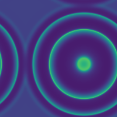

### Gray-Scott model

The Gray-Scott model models the following reaction:

$U + 2V \rightarrow 3V$

Though since the reaction consumes $U$ and produces $V$ it is necessary to control the reaction. This is done by using a feed rate $F$ and a kill rate $k$ giving the following equations:

$\frac{du}{dt} = \mu_u \nabla(u) - uv^2 + F(1-u)$

$\frac{dv}{dt} = \mu_v \nabla(v) + uv^2 - (F + k)v$

where as above $\nabla$ is the diffusion term.

To get a decent model I suggest that you use the following values for the parameters:

```python
F = 0.03
k = 0.063
mu_u = 0.2
mu_v = 0.1
dt = 1
```

The initial concentrations should be $1$ everywhere for $U$ and $0$ everywhere for $V$ except at 5 random locations where it should be 1.

An example of a result with the previous parameters is the following:

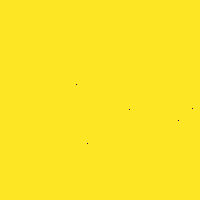

## Continuous game of life

This project aims at implementing a version of [Lenia]. An extension of Conway's Game of Life (CGoL) to continuous states, space and time.

Here are the requirements:

- Lenia should be written as **classes** that have a method `run` that takes as a parameter the desired number of iterations `n` and returns the state of the arena after `n` iterations (note that if you want to save the results of your model you will need to save the steps of the process).
- The class can be implemented either within a notebook or as a "pip installable" program.
- A succinct README.md file should be written for me to know what are the necessary libraries and how to run your program.
- Here, I would suggest to use an arena size of $64$ by $64$ to start with.

Let us define the following terms:

- arena: our grid that has a given size $M$ by $M$
- cell: a $(i, j)$ position on the grid
- cell state: the value in the CGoL of a cell

But first let's reformulate CGoL.

### Reformulation of CGoL

The original formulation is the following:

- if a cell state value is $1$ and the cell has $2$ or $3$ neighbours, it stays $1$ otherwise it becomes $0$
- if a cell state value is $0$ and the cell has exactly $3$ neighbours, it becomes $1$ otherwise it stays $0$

Now let assume that we threshold our states between $0$ and $1$, meaning that if a state ends up with a value below $0$ it is put to $0$ and if a state ends up higher than $1$ it is set to $1$. Then the previous rules could be reformulated as follow:

- if a cell has $2$ neighbours, it does not change its state
- if a cell has $3$ neighbours, it state is increased by $1$
- otherwise the cell state is decreased by $1$

With that in mind, we can reformulate the CGoL as a combination of a convolution by a kernel (counting the number of neighbours as we have seen in class) and a growth function that will dictate the local change of our state values given the result of the convolution.

As a reminder, here is the kernel that we used:

$$
K = \begin{bmatrix}
0 & 1 & 0\\
1 & 0 & 1\\
0 & 1 & 0\\
\end{bmatrix}
$$

We have already seen the convolution by a kernel so let us have a look at the growth function.

To comply with the rules of the CGoL we can build a growth function $G$ that takes as input an output of the convolution and returns the change of state. Such a function $G$ can be written as follow:

$
G(n)=
\begin{cases}
   0 &\text{ if }n=2\\
   1 &\text{ if }n=3\\
   -1 &\text{ otherwise}
\end{cases}
$

where $n$ is the number of neighbours given by the convolution of the arena by the kernel.

That basically means that if a cell has 2 neighbours it does not change ($+0$ change), if a cell has $3$ neighbours it increase its state value by $1$ (remember that we threshold our states between $0$ and $1$) and otherwise the state value is decreased by $1$.

The previous growth function can be visualised as such:

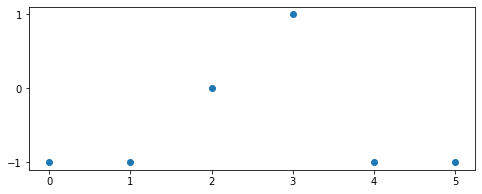

So, given the information provided above, one could rewrite the CGoL as follow:

Given a state $S_t$ of our arena at a time $t$, a kernel $K$, a convolution operator $*$ and our growth function $G$, the state of the arena at time $t+1$ can be written as:

$
S_{t+1} = \Big[S_t + G(S_t*K)\Big]_0^1
$

where $[x]_a^b = \max(a, \min(x, b))$.

### From discrete states to continuous states

Given the proposed rewriting we can "easily" go from discrete states ($0$ or $1$) to continuous ones (let say any value between $0$ and $1$). Indeed, instead of choosing a growth function that takes its values in $\{-1, 0, 1\}$ it could be defined for any value in $[-1, 1]$.

But first, for commodities, let's assume that we normalise the number of neighbours by the maximum number of neighbours possible (ie the number of neighbours becomes the fraction of maximum number of neighbours possible).
This normalisation allows us to use the growth function regardless of the neighbour kernel we choose.

For example we could use a Gaussian function:

$
G(n) = 2\times \exp\Big(-(\frac{n - \mu_G}{2\sigma_G})^2\Big) -1
$

(note that the "$2\times$" and the $-1$ are there so that the values of the Gaussian vary between $-1$ and $1$).

This new growth function can be visualised as such:

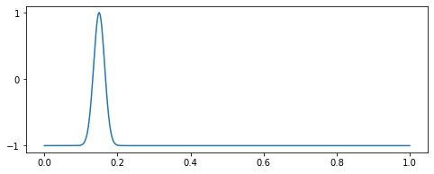

Note that the function takes values in $[0, 1]$ rather than $[0, 5]$ as the previous growth function. That is because of the normalisation of the number of neighbours.

Now, we can apply this new growth function and we should have continuous states (of course, continuous up to the precision of our machine).

### From discrete to continuous space

Given the proposed rewriting we can also "easily" go from discrete space (binary neighbours kernel) to continuous space.
Indeed, instead of choosing a kernel that has its values in $\{0, 1\}$ it could be defined for any floating value in $[0, 1]$.

For example we could choose to use the following gaussian ring kernel.

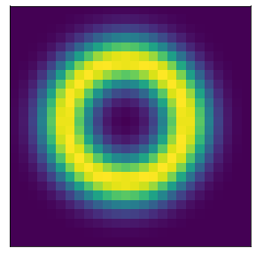

This gaussian kernel mimics the computation of a ring of neighbors in a "continuous" space.
Note that because we have a continuous space the kernel is not of size $3$ by $3$ anymore but it has a given radius $r$ that will be a parameter of our model (here $r=13$ for example, meaning that the kernel as a size of $26\times26$).

The above kernel can be seen as a gaussian function that depends on the distance to the center of the said kernel.

In other words, let $D$ be a 2D matrix where $D(i, j) = ||c - (i, j)||_2$ (where $c$ is the coordinate of the centre of the matrix $D$ and $||\cdot||_2$ is the L2 norm).
Here is an example of what $D$ looks like with $r=13$:

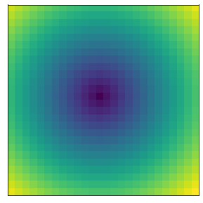

then you can describe the ring kernel before normalisation ($RK_{\not n}$) as a gaussian function applied to that distance:

$$
RK_{\not n}(i, j) = \exp\Big(-\big(\frac{D(i, j) - \mu_K}{2\sigma_K}\big)^2\Big)
$$

and then $RK$ can be defined as follow:
$$
RK(i, j) = \frac{RK_{\not n}(i, j)}{\sum_{k}\sum_l RK_{\not n}(k, l)}
$$

### From discrete to continuous time

This is easily done by using a $\delta t\lt 1$ as we did for the Turing models.

### From theory to practice

Now that we have defined how to go from discrete to continuous in theory we need to implement it.

I would suggest that you first try to re-implement the CGoL with the growth function, that should give you a proper start to play with.
You can then modify the growth function together with the Kernel function at will to obtain the proper behaviour.

Then, I would suggest that you use the following parameters to do tests:

- arena size: 64 by 64 (to keep the calculations fast while you are testing and debugging)
- $r = 13$
- $\delta t = 0.1$
- $\mu_G = 0.15$
- $\sigma_G = 0.015$
- $\mu_K = 0.5$
- $\sigma_K = 0.15$

While I let you implement the growth function by yourself (since it is fully defined by its $\sigma$ and $\mu$), here is some help to implement the ring kernel:

```python
from scipy.ndimage import distance_transform_edt
## First build a kernel of size 2 * radius by 2 * radius
D = np.ones((2*radius, 2*radius), dtype=np.float32)
## Second build the D matrix by
## first putting a 0 in the center
D[radius-1, radius-1] = 0
## and then using the distance_transform_edt function
## from scipy.ndimage and normalising by the radius
D = distance_transform_edt(D) / radius
## Applying a gaussian to the distances
## setting values further than  to zero when further than the radius
RK_nn = (D<1) * gaussian(D, mu_kernel, sigma_kernel)
RK = RK_nn / np.sum(RK_nn)
```

There are few choices that could be made when implementing the ring kernel.
Feel free to implement it your way but it might break the known patterns.

Using the aforementioned parameters with an arena with random values between 0 and 1 you should get the following result (the arena is of size 200 by 200, depending on your computer, it could put strain on it):


### Using known patterns

To have more interesting results you can use known patterns.
One of them is called Orbium:

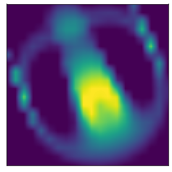

When running this pattern in an otherwise empty arena, this is the result (still in a 200 by 200 arena):

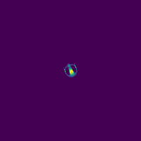

You can load the orbium from the file in `Lenia_examples/Orbium.npy` as follow:

```python
import numpy as np
np.load("path/to/Lenia_examples/Orbium.npy")
```

Another example is the Helicium:

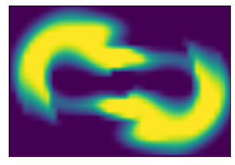

That when run with $\mu_G = 0.35$ and $\sigma_G = 0.06$ gives the following results:

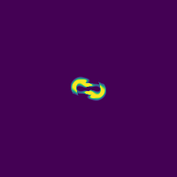

The helicium can be found in `Lenia_examples/Helicium.npy`

A final example with `Lenia_example/Hexacaudopteryx.npy`:

The template:

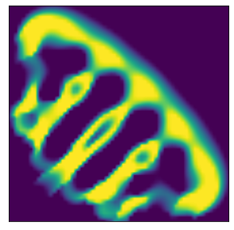

The result (see as it degenerates because of border effects):

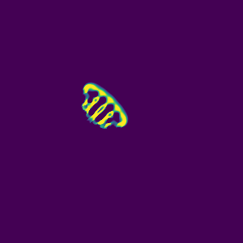

### To go further

If you really want to push further this project:

1) you can do it by first re-implementing the convolution using Fourier Transform which should speed up the process greatly
2) you can have a kernel with multiple rings
3) you can have multiple kernels
4) you can have multiple channels

### Acknowledgments

For this assessment I which to acknowledge the [Lenia portal] that provided me with the examples and their parameters

[Lenia]: https://en.wikipedia.org/wiki/Lenia
[Lenia portal]: https://chakazul.github.io/Lenia/JavaScript/Lenia.html
